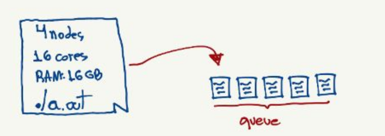
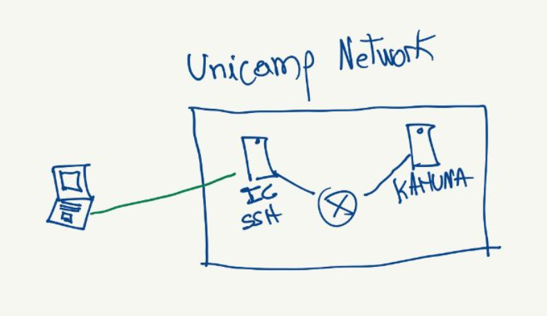

# Do not run your program on the login node! Read further to see how to correctly execute your program. If you do not comply, administrators will be notified.

# Kahuna Cluster

## Job scheduling introduction

HPC clusters rely on job scheduling systems to fairly allocate resources to it's users. That said, to run your program, you must describe the resources that it will need and then send it to a queue to wait for execution.

The overall process is pretty straight forward:

1. Send your program to the cluster:


2. Write a job file specifyng the resources that should be allocated to your program, and add it to the cluster queue:



Although simple, there are some caveats. This document describes how to connect to the cluster, send your files, write a valid job file and then retrieve the results.

## Accessing the Cluster

The Kahuna cluster *must* be accessed from the Unicamp network or through Unicamp's VPN. Instructions on how to use the VPN can be found [here](https://www.ccuec.unicamp.br/ccuec/servicos/acesso_remoto_vpn). Alternatively, you can just SSH to institute of computing (instructions [here](http://www.students.ic.unicamp.br/acessoremoto.shtml)) and then SSH to Kahuna. This works because IC's SSH is inside Unicamp's network:



That said, you can login with:

```sh
ssh ra<your RA>@ssh.students.ic.unicamp.br
ssh -YC <username>@kahuna.iqm.unicamp.br
```

### Opitional SSH configuration

To automate the connection process, you can create a SSH configuration file in the path `~/.ssh/config` with the following content:

```
Host ic
    User ra<your RA>
    HostName ssh.students.ic.unicamp.br

Host kahuna
    User <your kahuna user>
    Hostname kahuna.iqm.unicamp.br
    ProxyCommand ssh ic -W %h:%p
```

Finally, for security reasons, you must make this file visible for your user only with `$ chmod 600 ~/.ssh/config`.

With this configuration, you can establish a connection simply by running `$ ssh kahuna`.

Additionally, you can use your public key to authenticate, avoid typing the password at each connection. To do so, generate your authentication keys with:

`$ ssh-keygen`

You can use the default options. Then, use `ssh-copy-id` to save your key on the remote computer:

`$ ssh-copy-id kahuna`

# Remember to change your password using `$ passwd`

## Sending files

You can use `rsync` or `scp` to copy files from your local computer to the cluster.

For example, you can use the command bellow to send your files:

```sh
rsync -razv --progress myfolder/ <username>@kahuna.iqm.unicamp.br:~/
```

To retrieve them, simply use:

```sh
rsync -razv --progress <username>@kahuna.iqm.unicamp.br:~/myfolder .
```

Alternatively, you can use `git clone` after logging in on the cluster.

## Running jobs: Modules and PBSPro

### Modules

Kahuna uses [Modules](https://gitlab.com/brcloud/brcloud-dev/-/wikis/Tutorial-Slurm,-Module-and-Singularity) to load user-required applications on the environment. Using `$ module avail` will list the software that can be used to compile and run your programs. This consult is useful, since Kahuna's manual is not up to date.

Modules allow the user to set the environment as needed, allowing the user to load the desired version of the installed programs. If, for example, a user needs GCC 7.2, it can be loaded with:

```sh
module load compiler/gcc-7.2
```

Note that this can be used on both login environment and job batchs.

### PBSPro

Bellow there are some information about PBSPro, the job manager installed on the Kahuna cluster. For more comprehensive information regarding this software, consult the [PBSPro 13.0 guide](https://www3.risc.jku.at/projects/mach2/documentation/PBSProUserGuide.pdf).

### qsub

`qsub` is used to submit a job in a queue. Most of the job parameters, like resource allocation, can be either defined on the job file or passed to `qsub` as an argument. You can use `man qsub` fore more information. On the examples presented in this page, all the parameters will be defined inside the job file.
The usage is as follow:

```sh
qsub my-job.pbs
```

A job file should look like the following example:

```sh
#PBS -q route
#PBS -N job-name
#PBS -o job-std-output.out
#PBS -e job-err-output.err
#PBS -V
#PBS -l select=3:ncpus=1:ngpus=0:Qlist=Compute
#PBS -l place=scatter
#PBS -l walltime=01:00:00
#!/bin/sh

echo "Hello World!"
hostname # will print the machine hostname
```

The above example will run in three different machines, allocating one CPU per machine.

| Parameter   | Description                                                                                                                                                                                                                                                          |
|-------------|----------------------------------------------------------------------------------------------------------------------------------------------------------------------------------------------------------------------------------------------------------------------|
| -q          | The queue to which the job should be submitted. Information about all Kahuna's queues can be found [here](http://cces.unicamp.br/computing-resources/).                                                                                                              |
| -l select   | Used to allocated resources for the given job.                                                                                                                                                                                                                       |
| -l place    | Specify how the selected resources should be captured across the cluster. If not specified, the job manager will fall to the default policy. The option 'scatter' will make each selection on a different host, and is useful for benchmarking distributed programs. |
| -l walltime | Time before a job is killed due to timeout. If not specified, a job may never run, since the scheduler assumes a very long time as default. Each queue has a maximum acceptable walltime.                                                                            |

### qdel

Used to delete a submitted job, thus requiring a job id.

```sh
qdel jobid
```

### qstat

Used to show the status of batch jobs. Some usages:

| Usage             | Description                             |
|-------------------|-----------------------------------------|
| qstat             | Show information about queues and jobs. |
| qstat -u \`whoami\` | List your submitted jobs                |
| qstat -B          | Summary information about PBS server    |
| qstat -r          | List running jobs                       |
| qstat -q          | List queues                             |
| qstat -Q          | List queue limits                       |

## Examples

Ready-to-use job files are available on the template repositories as PBS files.

Usage:

```sh
$ qsub my-job.pbs
```

If you want to **wait until your job finshes**, you can tell `qsub` to exit only after the execution ends:

```sh
$ qsub -Wblock=true my-job.pbs
```
